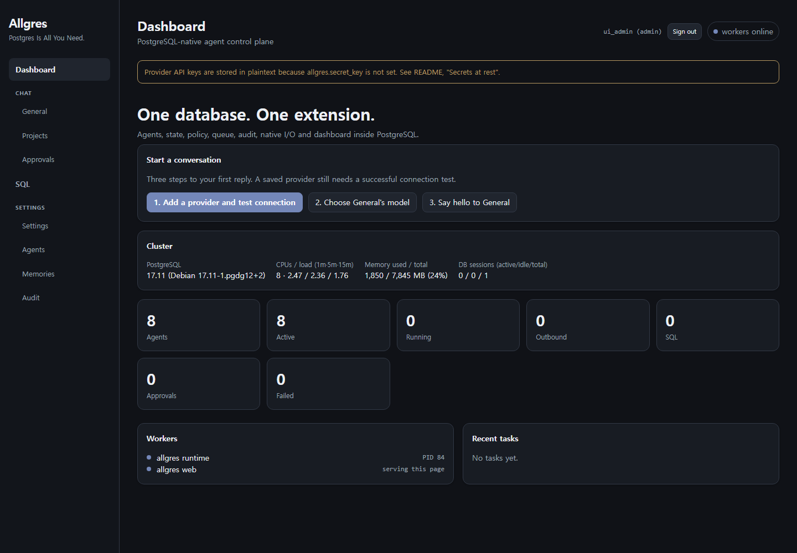

# Allgres

## Postgres Is All You Need.

**Your agents, their tools, their decisions, and the audit trail—in PostgreSQL.**

Allgres turns PostgreSQL into an agent control plane. A PL/pgSQL state machine, a Rust/pgrx runtime worker, outbound HTTP, and a browser dashboard ship as one extension. Create an agent, connect a model, and inspect its work with SQL you already know.

> **Public alpha · `0.1.0-alpha.3`** — built for evaluation. Read the [security model](docs/security.md) and [known limitations](KNOWN_ISSUES.md) before using real data or exposing the dashboard. Report vulnerabilities through [private disclosure](SECURITY.md).

## Quick start

| Route | Best for | What you get |
| --- | --- | --- |
| [Docker](docs/deployment/docker.md) | A local trial in minutes | PostgreSQL 17 and Allgres in one container |
| [CNPG](docs/deployment/cnpg.md) | A CloudNativePG cluster | PostgreSQL 18 extension image and example manifests |
| [Source code](docs/deployment/source-install.md) | An existing PostgreSQL 16, 17, or 18 server | Build and install the extension with `make` |
| [RPM](docs/deployment/rpm.md) | Fedora 43 with PostgreSQL 18 | Download or build and install a native package |

### Docker: the fastest first run

```bash
git clone https://github.com/allgres/allgres-agent.git
cd allgres-agent
docker compose up -d --build
./scripts/bootstrap.sh
```

Open **http://127.0.0.1:8088**. The bootstrap script waits for health, creates a first admin, and runs an agent task against the built-in mock provider. For the newest published image, pull `ghcr.io/allgres/allgres-agent:latest`; `:main` follows development commits, while `:v0.1.0-alpha.3` pins this release. See the [Docker guide](docs/deployment/docker.md) for `docker run`, persistence, and the production overlay.

After signing in, use the dashboard's **Start a conversation** guide: add a chat provider and run **Test connection** in Settings, choose a provider and model for the **general** agent, then open **General** and send a message. General is a direct conversation; **Team messages** uses `@agent-name` when you want to route a post to one or more agents. Agents without a model can be saved explicitly as inactive drafts. A new chat project requires an agent.



*Fresh local install. The banner explains that API keys need `ALLGRES_SECRET_KEY` for encryption at rest; see [Secrets at rest](docs/security.md).*

### CNPG: add Allgres to your cluster

Build the extension image from the repository root, or use `ghcr.io/allgres/allgres-agent-cnpg-ext:latest`. The [CNPG guide](docs/deployment/cnpg.md) and [`cnpg/cluster-example.yaml`](cnpg/cluster-example.yaml) show the `Cluster` and `Database` resources. This path requires the CNPG operator, PostgreSQL 18, and Kubernetes ImageVolume support. Alpha.2 passed 362 self-tests, worker startup, and the dashboard health check in an isolated Kubernetes 1.36/PostgreSQL 18 cluster; this release adds first-run Test connection, General assignment, and the health_monitor Agents-list fold.

### Source code: install into PostgreSQL you manage

```bash
git clone https://github.com/allgres/allgres-agent.git
cd allgres-agent
make install
ALLGRES_BOOTSTRAP_ADMIN_USER=admin ALLGRES_BOOTSTRAP_ADMIN_PASSWORD='choose-a-strong-password' make quickstart
```

Install the matching PostgreSQL server development package, C toolchain, and OpenSSL development files first. `make install` copies extension files; `make quickstart` configures a live database. The [source guide](docs/deployment/source-install.md) covers prerequisites, privileges, and a persistent `shared_preload_libraries` setup.

### RPM: package PostgreSQL 18

The [RPM guide](docs/deployment/rpm.md) finds the newest published Fedora 43/PostgreSQL 18 RPM automatically, and also covers building the package from source.

## What runs inside Postgres

- **Agent execution** — policies, permissions, delegation, retries, budgets, and human approval.
- **SQL as a governed tool** — agent queries are parsed and run under an unprivileged role. [Sandbox design](docs/sql-sandbox.md).
- **Search and memory** — agent discovery, `remember`/`recall`, and optional pgvector acceleration. [Memory and search](docs/memory-and-search.md).
- **An operator dashboard** — agents, chat, approvals, audit, SQL, and settings in one static page. [Model setup](docs/chat-and-models.md).
- **Inspectability** — task state, policy history, and consequential mutations live in queryable tables. [Architecture](docs/architecture.md) · [Audit log](docs/audit-log.md).

No Node, Python, Redis, RabbitMQ, or separate web server is required at runtime. `pgcrypto` and `pgvector` are optional extensions; see [configuration](docs/configuration.md) and [security](docs/security.md) for the tradeoffs.

## Alpha status

The repository includes CI jobs for native PostgreSQL 16–18, Docker smoke tests, a CNPG extension-image build, browser navigation, and RPM build/lint. Check the repository's [Actions](https://github.com/allgres/allgres-agent/actions) for the current commit's result. Local `nerdctl` checks passed for the Docker runtime and published Fedora RPM. The published CNPG image passed a live Kubernetes smoke test. The [readiness notes](docs/open-alpha-readiness.md) and [known issues](KNOWN_ISSUES.md) track remaining work.

## Known limitations

See [KNOWN_ISSUES.md](KNOWN_ISSUES.md) for current alpha limitations.

Want to see a real agent task? Try the [order-review example](examples/order-review/README.md). To contribute, start with [CONTRIBUTING.md](CONTRIBUTING.md). For deployment and backups, see the [deployment guides](docs/deployment/docker.md) and [backup guide](docs/backup-and-restore.md).

Apache-2.0. [License](LICENSE).
